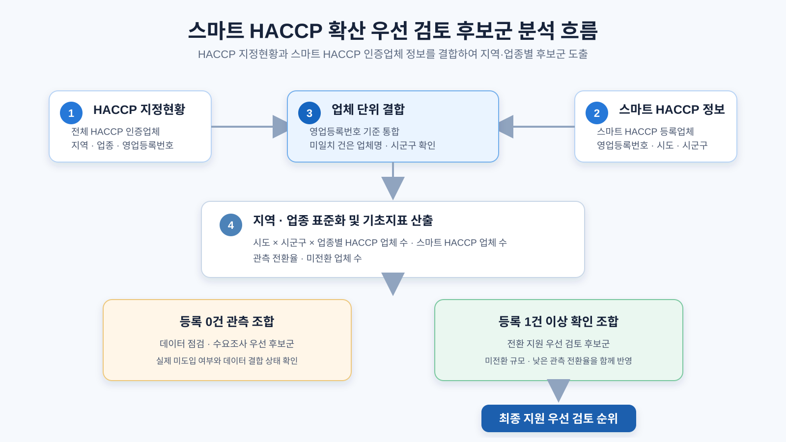

# 스마트 HACCP 확산 우선 검토 후보군 분석

> HACCP 지정현황과 스마트 HACCP 인증업체 정보를 결합하여, 한정된 확산 지원을 어디의 어떤 업종부터 검토할지 데이터로 제안하는 공공데이터 분석 프로젝트입니다.



## 1. 프로젝트 개요

스마트 HACCP은 IoT 등 정보통신기술을 활용해 식품 제조공정의 중요관리점(CCP) 데이터를 자동으로 기록·관리하는 체계입니다. 정부는 식품안전관리의 디지털 전환을 추진하고 있으며, 2026년에는 스마트 HACCP 적용 범위를 제조·가공 단계에서 도축·집유 단계까지 확대하겠다고 발표했습니다.

그러나 스마트 HACCP의 등록 수준은 아직 낮습니다. 2025년 6월 기준 HACCP 인증업체 21,693개소 중 스마트 HACCP 등록업체는 486개소로 2.2%였습니다. 따라서 모든 업체를 같은 방식으로 지원하기보다, 미전환 업체 규모와 관측 전환 현황을 함께 고려해 현장 조사와 지원을 우선 검토할 지역·업종 후보군을 찾을 필요가 있습니다.

이 프로젝트는 개별 업체의 지원 여부를 자동으로 결정하지 않습니다. `시도 × 시군구 × 업종` 단위의 후보군을 도출한 뒤, 실제 도입 의향·비용 부담·공정 적합성을 확인할 후속 수요조사와 현장 진단의 근거를 제공합니다.

### 핵심 질문

1. 어느 지역·업종에 HACCP 인증업체와 미전환 업체가 많이 분포하는가?
2. 스마트 HACCP 등록이 관측되지 않거나 낮은 지역·업종은 어디인가?
3. 데이터 결합 한계를 고려할 때, 어디를 지원 확정이 아닌 **수요조사·공정 진단 우선 후보군**으로 제시해야 하는가?

## 2. 분석 범위와 원칙

| 항목 | 내용 |
|---|---|
| 최종 분석 단위 | `시도 × 시군구 × 업종` |
| 분석 모집단 | HACCP 지정현황의 영업등록번호 기준 업체 |
| 주 분석 표본 | HACCP 업체 수가 30개 이상인 조합 |
| 등록 0건 조합 | 실제 미도입 여부를 확인할 데이터 점검·수요조사 우선군 |
| 등록 1건 이상 조합 | 전환 지원 우선 검토 순위 산출 대상 |
| 분석 목적 | 지원 확정이 아닌 사전 조사와 정책 지원 배분의 근거 제시 |

단순히 전환율이 낮은 조합을 지원 1순위로 단정하지 않았습니다. 스마트 HACCP 등록이 0건인 경우에는 실제 미도입일 수도 있지만, 데이터 시점 차이·영업등록번호 변경·결합 누락일 수도 있기 때문입니다. 따라서 0건 조합은 순위에서 분리해 확인 대상으로 다룹니다.

## 3. 활용 데이터

| 구분 | 데이터 | 제공기관 | 핵심 컬럼 | 분석 목적 |
|---|---|---|---|---|
| 공공데이터 | 식품의약품안전처 HACCP 지정현황 | 식품의약품안전처 | `LCNS_NO`, `BSSH_NM`, `INDUTY_CD_NM`, `SITE_ADDR`, `SSIZESCALE_BSSH_YN` | 전체 HACCP 업체 수, 지역, 업종, 소규모 업체 여부 산출 |
| 공공데이터 | 식품 스마트 HACCP 인증업체 정보 서비스 | 한국식품안전관리인증원 | `licenseno`, `company`, `sido`, `sgg`, `ccp` | 스마트 HACCP 등록 여부 및 지역 정보 확인 |

원본 CSV는 재현성을 위해 `data/raw/`에 포함합니다. API 키는 저장소에 포함하지 않습니다.

```text
data/raw/
├── haccp_designation_raw.csv
└── smart_haccp_raw.csv
```

## 4. 데이터 전처리와 결합

### 4-1. 품목 행을 업체 단위로 통합

원본 데이터는 하나의 업체가 여러 품목 또는 인증 건을 가질 수 있어 동일 업체가 여러 행에 나타납니다. 이에 따라 영업등록번호를 기준으로 중복을 통합했습니다.

| 데이터 | 원본 행 수 | 업체 단위 고유 수 |
|---|---:|---:|
| HACCP 지정현황 | 27,238 | 8,848 |
| 스마트 HACCP 인증업체 정보 | 1,046 | 308 |

### 4-2. HACCP과 스마트 HACCP 정보 결합

`LCNS_NO`와 `licenseno`를 영업등록번호 기준으로 직접 결합했습니다. 직접 결합된 232개 외에, 업체명과 시도·시군구가 함께 일치한 2개 사업장을 보조 결합했습니다. 동일 사업장 여부를 확정할 수 없는 데이터는 자동으로 결합하지 않았습니다.

최종적으로 HACCP 업체 8,848개 중 스마트 HACCP 등록이 확인된 업체는 234개입니다. 이 수치는 현재 저장된 원본 데이터와 명시적 보조 결합 기준에 따른 분석용 관측치입니다.

### 4-3. 지역과 업종 표준화

- 사업장 주소에서 시도와 시군구를 추출했습니다.
- 비표준 지역 표기는 시군구 정보를 활용해 분석용 시도로 정리했습니다.
- 업종은 HACCP 지정현황의 업종명을 사용했습니다.
- 지역 또는 업종이 확인되지 않는 경우는 기초 현황에는 남기되 순위 산출 대상에서 제외했습니다.

## 5. 지표 산출

각 `시도 × 시군구 × 업종` 조합에 대해 아래 지표를 계산합니다.

| 지표 | 계산식 | 해석 |
|---|---|---|
| HACCP 업체 수 | 해당 조합의 영업등록번호 수 | 잠재 지원 규모 |
| 스마트 HACCP 업체 수 | 스마트 HACCP 등록이 확인된 업체 수 | 관측된 도입 규모 |
| 관측 전환율 | 스마트 HACCP 업체 수 ÷ HACCP 업체 수 | 상대적 전환 수준 |
| 미전환 업체 수 | HACCP 업체 수 − 스마트 HACCP 업체 수 | 지원 효과가 미칠 수 있는 규모 |
| 소규모 업체 비율 | 소규모 업체 수 ÷ HACCP 업체 수 | 대상군 특성 파악용 보조 지표 |

## 6. 우선 검토 후보군 도출 방식

### 6-1. 등록 0건 관측 조합

HACCP 업체가 30개 이상이지만 스마트 HACCP 등록이 0건으로 관측된 조합은 **데이터 점검·수요조사 우선 후보군**으로 분리합니다. 이 조합은 등록 누락 여부, 실제 도입 수요, 비용 부담, 센서·자동기록 적용 가능성을 먼저 확인해야 합니다.

### 6-2. 전환 지원 우선 검토 순위

스마트 HACCP 등록이 1건 이상 확인된 조합만 대상으로 다음 두 지표를 0~1 범위로 정규화합니다.

1. 미전환 업체 수: 많을수록 우선
2. 낮은 관측 전환율: 낮을수록 우선

두 지표가 모두 높은 상태를 이상점으로 두고, 각 조합과 이상점 사이의 유클리드 거리를 계산합니다.

```text
이상점거리 = √{(1 - 미전환업체수_정규화)² + (1 - 낮은관측전환율_정규화)²}
```

거리가 짧을수록 미전환 규모가 크고 관측 전환율이 낮아, 전환 지원을 우선 검토할 필요가 큰 후보군으로 해석합니다. 두 지표에는 임의의 가중치를 부여하지 않고 동일하게 반영했습니다.

### 6-3. 소표본 왜곡 방지와 민감도 검증

업체가 1~2개인 조합은 등록 여부에 따라 전환율이 0% 또는 100%가 되어 해석이 왜곡될 수 있습니다. 이에 주 분석은 최소 30개 업체를 기준으로 수행했습니다. 또한 최소 업체 수 기준을 20개·30개·50개로 바꿔 Top 10 후보군의 변화를 확인합니다.

## 7. 현재 원본 기준 분석 결과

현재 저장된 원본 데이터를 기준으로 다음과 같이 후보군이 구분되었습니다.

- 최소 30개 업체 기준 조합: 95개
- 등록 0건 관측 조합: 36개
- 등록 1건 이상 전환 지원 우선 검토 조합: 59개

### 전환 지원 우선 검토 Top 10

| 순위 | 지역·업종 | 관측 전환율 | 미전환 업체 수 |
|---:|---|---:|---:|
| 1 | 부산 사하구 · 식품제조가공업소 | 1.6% | 186 |
| 2 | 경기 성남시 · 식품제조가공업소 | 2.4% | 165 |
| 3 | 경기 파주시 · 식품제조가공업소 | 3.4% | 172 |
| 4 | 경기 고양시 · 식품제조가공업소 | 0.7% | 141 |
| 5 | 경기 포천시 · 식품제조가공업소 | 1.4% | 136 |
| 6 | 경기 남양주시 · 식품제조가공업소 | 1.6% | 126 |
| 7 | 충남 천안시 · 식품제조가공업소 | 2.3% | 128 |
| 8 | 경기 용인시 · 식품제조가공업소 | 5.4% | 176 |
| 9 | 제주 제주시 · 식품제조가공업소 | 3.0% | 129 |
| 10 | 경기 이천시 · 식품제조가공업소 | 1.9% | 106 |

상위 후보가 식품제조가공업소에 집중되는 것은 전체 HACCP 업체 중 해당 업종 비중이 큰 데이터 분포를 반영한 결과입니다. 이를 곧바로 특정 업종만 지원해야 한다는 결론으로 해석하지 않고, 해당 업종 중심의 공동 설명회·사전 진단·수요조사를 우선 검토하는 근거로 활용합니다.

## 8. 기대효과와 활용 방안

### 기대효과

- 전체 HACCP 업체 8,848개를 지역·업종별 95개 우선 검토 조합으로 구조화합니다.
- 등록 0건 조합과 전환 지원 후보군을 분리해 데이터 불확실성을 결과에 반영합니다.
- 미전환 규모와 관측 전환율을 함께 고려해, 단순 등록업체 수 비교보다 설명 가능한 지원 검토 근거를 제공합니다.
- 최소 표본 기준을 달리한 민감도 검증으로 특정 기준에만 의존하지 않는 후보군을 제시합니다.

### 활용 대상

| 활용 대상 | 활용 방식 |
|---|---|
| 식품의약품안전처 및 한국식품안전관리인증원 | 스마트 HACCP 확산사업의 사전 조사 대상 지역·업종 선정 및 운영 현황 점검 |
| 지방자치단체 | 관할 시군구 내 미전환 업체가 많은 업종의 설명회·교육·컨설팅 대상 선정 |
| 식품 제조·가공업 관련 협회 | 업종별 공동 교육, 도입 사례 확산, 수요조사 기획 |
| HACCP 인증업체 | 동일 지역·업종의 관측 전환 현황을 참고한 도입 검토 |

## 9. 한계와 후속 과제

이 분석은 등록 데이터에 기반한 관측 분석입니다. 다음 항목은 현재 두 데이터만으로 판단할 수 없습니다.

- 실제 스마트 HACCP 도입 의향
- 도입 비용과 인력 부담
- 공정별 센서·자동기록 적용 가능성
- 업체별 생산 규모와 설비 수준
- 데이터 갱신 시점 차이 및 영업등록번호 변경

따라서 우선순위 결과는 지원 확정 명단이 아니라, 설문·현장 인터뷰·공정 진단을 먼저 수행할 후보군으로 활용해야 합니다. 후속 단계에서는 도입 장벽과 참여 의향을 조사해 컨설팅, 교육, 장비 지원을 차등 설계할 수 있습니다.

## 10. 실행 방법

```powershell
pip install -r requirements.txt
python -X utf8 analysis_pipeline.py
```

입력 데이터 경로나 출력 폴더를 바꾸려면 다음과 같이 실행할 수 있습니다.

```powershell
python -X utf8 analysis_pipeline.py --input-dir data/raw --output-dir results
```

## 11. 생성 파일

분석 실행 후 `results/` 폴더에 아래 파일이 생성됩니다.

| 파일 | 설명 |
|---|---|
| `city_industry_summary.csv` | 시도·시군구·업종별 기초 현황 |
| `zero_observation_candidates_n30.csv` | 등록 0건 관측 조합의 데이터 점검·수요조사 후보 목록 |
| `support_priority_ranking_n30.csv` | 등록 1건 이상 조합의 전환 지원 우선 검토 순위 |
| `sensitivity_top10.csv` | 최소 업체 수 20·30·50개 기준 Top 10 비교 결과 |
| `unmatched_smart_haccp_facilities.csv` | HACCP 명단과 직접 연결되지 않은 스마트 HACCP 업체 확인용 목록 |

## 12. 프로젝트 구조

```text
food_HACCP/
├── analysis_pipeline.py       # 전체 전처리·집계·후보군 도출 파이프라인
├── requirements.txt           # pandas, numpy
├── assets/
│   └── analysis_flow.svg      # 분석 흐름도
├── data/
│   └── raw/                   # 공공데이터 원본 CSV
└── results/                   # 실행 시 생성되는 분석 결과, Git 추적 제외
```

## 13. 출처

- [식품의약품안전처 HACCP 지정현황 Open API](https://www.data.go.kr/data/15058303/openapi.do)
- [한국식품안전관리인증원 식품 스마트 HACCP 인증업체 정보 서비스 Open API](https://www.data.go.kr/data/15118080/openapi.do)
- [농림축산식품부·식품의약품안전처, 스마트 해썹 제조·가공 넘어 도축·집유 단계까지 확대](https://www.mafra.go.kr/bbs/home/792/577469/artclView.do)
- [국회예산정책처, 2026년도 예산안 위원회별 분석](https://nabo.go.kr/board/file/down.do?fid=33318896)
